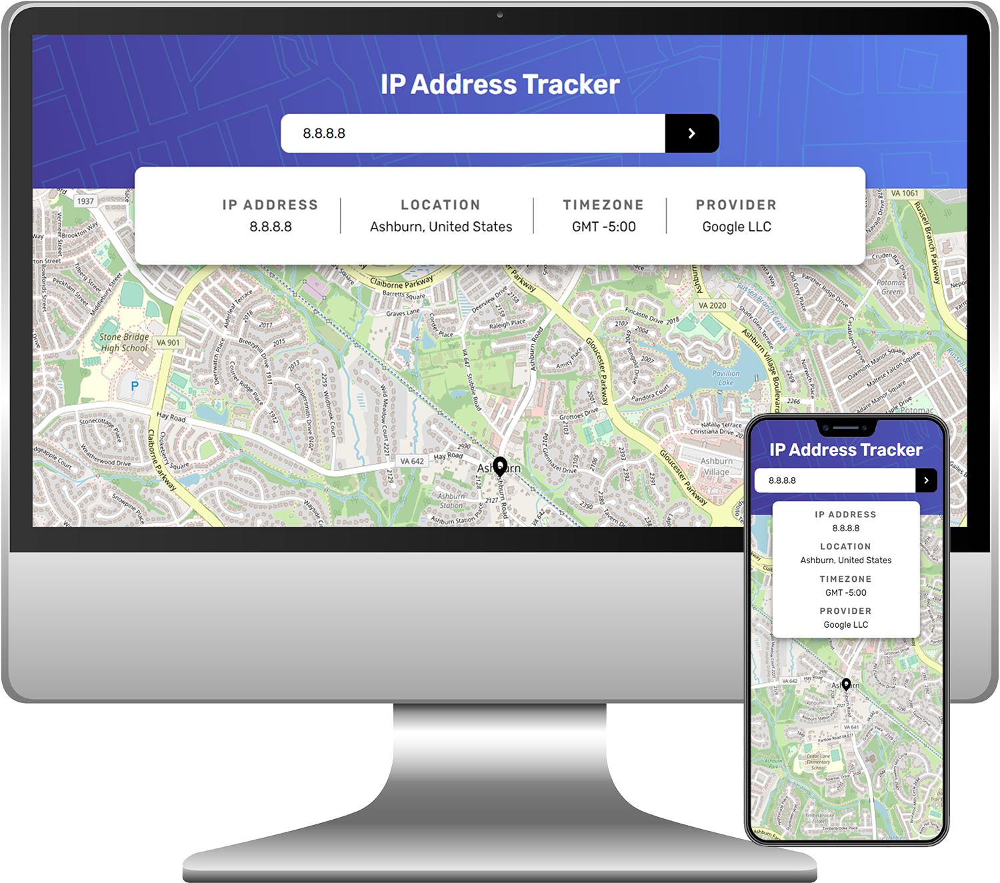

# IP Address Tracker

  <a href="#rocket-tecnologias">Tecnologias</a>&nbsp;&nbsp;&nbsp;|&nbsp;&nbsp;&nbsp;
  <a href="#-projeto">Projeto</a>&nbsp;&nbsp;&nbsp;|&nbsp;&nbsp;&nbsp;
  <a href="#-layout">Layout</a>&nbsp;&nbsp;&nbsp;|&nbsp;&nbsp;&nbsp;
  <a href="#-licença">Licença</a>

 

  

## 🚀 Tecnologias

Esse projeto foi desenvolvido utilizando as seguintes tecnologias:

- [Node.js](https://nodejs.org/en/)
- [Express](https://expressjs.com/pt-br/)
- [handlebars](https://handlebarsjs.com/)
- [nodefetch](https://github.com/node-fetch/node-fetch)

## 💻 Projeto

O IP Address Tracker é um site responsivo que busca a localização de protocolos de internet (IP)

Este é um projeto desenvolvido de acordo com um challenge do site [Frontend Mentor](https://www.frontendmentor.io/challenges/ip-address-tracker-I8-0yYAH0)

## 🔖 Layout

Você pode visualizar o layout do projeto através do link abaixo:

- [IP Address Tracker Template](https://www.figma.com/file/rCEzlvmaqekLSUOmrn3CKe/ip-tracker?node-id=17%3A13) 

Lembrando que você precisa ter uma conta no [Figma](http://figma.com/) para acessá-lo.

## 📝 Licença

Esse projeto está sob a licença [MIT](LICENSE.md).
OpenStreetMap® está sob a licença [OBDL](https://opendatacommons.org/licenses/odbl/)

---

Desenvolvido com 💜 por Wagner Rodrigues
